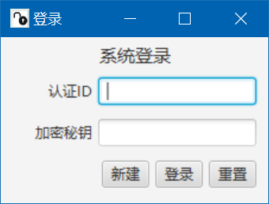
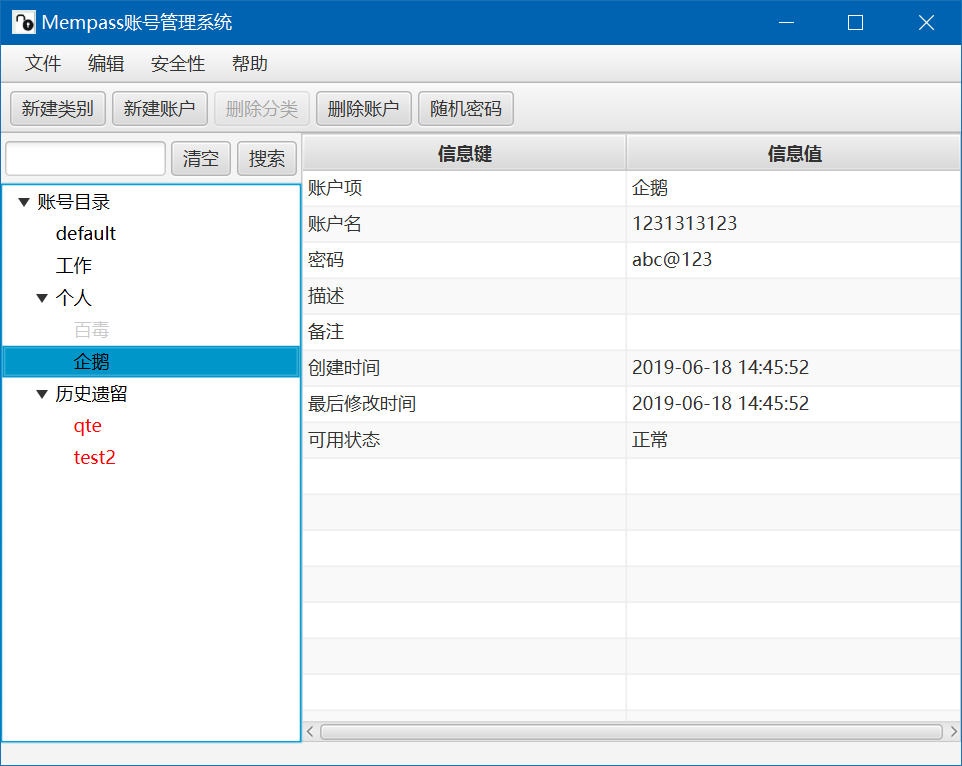

# 密码管理系统

基于JavaFX11的密码管理工具。

## 依赖

* 支持Java并具有图形界面的操作系统
* Java11

## 简介





## 打包

```
mvn clean package
```

## 运行

```
java -jar mempass-0.0.1-SNAPSHOT-jar-with-dependencies.jar
```

数据文件存储在用户目录下`.mempass`文件夹，本地存储基于H2数据库，可以到处为Excel。
