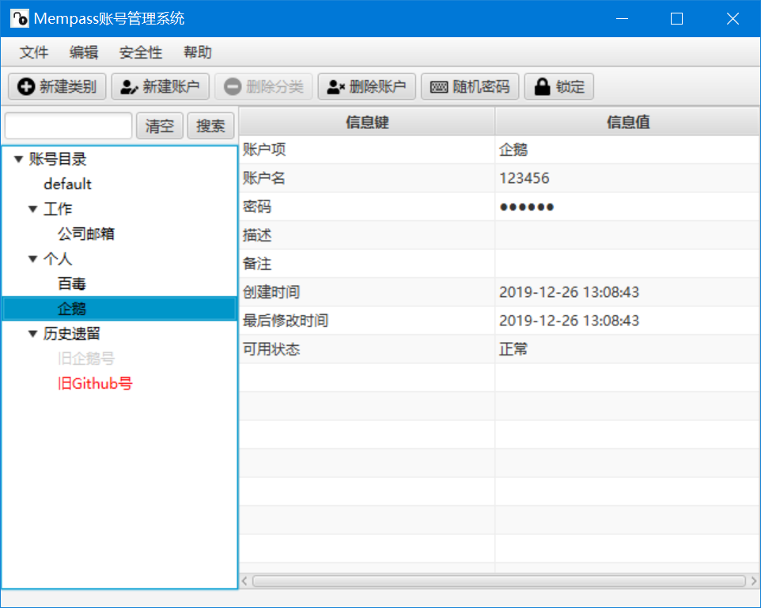

# 密码管理系统

JavaFX11写的密码管理工具，使用基于密码的对称加密，能够给予你一些心理上的安慰。

## 依赖

* 支持Java并具有图形界面的操作系统
* Java11

## 简介




## 打包

```
mvn clean package
```

由于若干依赖库没有支持模块化系统，`jlink`无法使用，带着整个JDK打包比较大，因此还是需要安装Java11的运行时。

## 运行

```
java -jar mempass-0.0.1-SNAPSHOT-jar-with-dependencies.jar
```

数据文件存储在用户目录下`.mempass`文件夹，本地存储基于H2数据库，可以导出为Excel。
